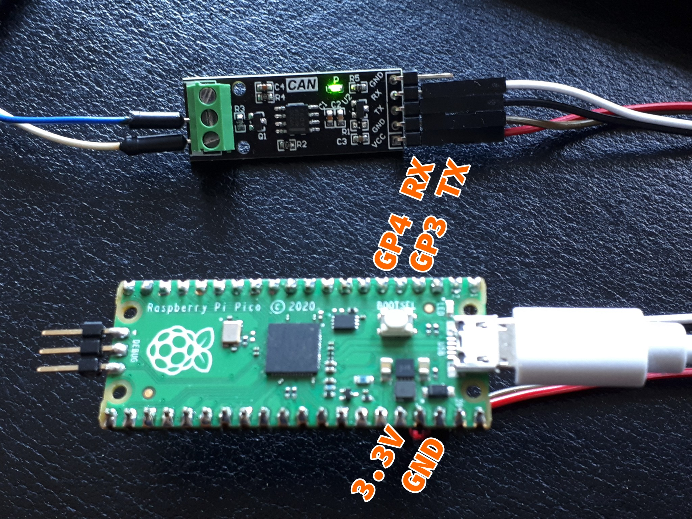

# __NMEA2000_can2040__ library for Raspberry Pi Pico / RP2040

__NMEA2000_can2040__ is a driver supplement to [__NMEA2000 library__ by Timo Lappalainen](https://github.com/ttlappalainen/NMEA2000).

It is based on the [__CAN2040__ implementation by Kevin O'Connor](https://github.com/KevinOConnor/can2040/) which makes use of the Raspberry Pi Pico's PIO.

Besides the Raspberry Pi Pico, only a CAN transceiver with 3.3V IO like the [SN65HVD230 (marking code VP230)](https://www.ti.com/lit/ds/symlink/sn65hvd230.pdf) is necessary.

## Usage

```lang=C++
// include NMEA2000_can2040.h header instead of NMEA2000_CAN.h
#include <NMEA2000_can2040.h>
#include <N2kMsg.h>
#include <NMEA2000.h>

// set NMEA2000 class
tNMEA2000_can2040 NMEA2000;
```

You can set PIO, TX-Pin & RX-Pin as follows:

```lang=C++
  /// @brief NMEA2000 constructor
  /// @param _Pio PIO to use, either 0 or 1
  /// @param _TxPin TX pin, default defined CAN2040_TX_PIN 3
  /// @param _RxPin RX pin, default defined CAN2040_RX_PIN 4
  tNMEA2000_can2040(uint32_t _Pio = CAN2040_PIO, uint32_t _TxPin = CAN2040_TX_PIN, uint32_t _RxPin = CAN2040_RX_PIN);
```

Or use the preprocessor defines `CAN2040_PIO`, `CAN2040_TX_PIN`, `CAN2040_RX_PIN` before the inclusion of `NMEA2000_can2040.h`.

## Hardware setup

You should use a CAN transceiver with 3.3V I/O, as the Pico RP2040 is a 3.3V device.

Connection example following the default setup:


Make sure your bus termination is correct.

## Licenses

CAN2040 is released under [GPLv3](doc/COPYING.can2040).

__NMEA2000_can2040__ is released under [MIT License](COPYING) (now get that sorted...).
